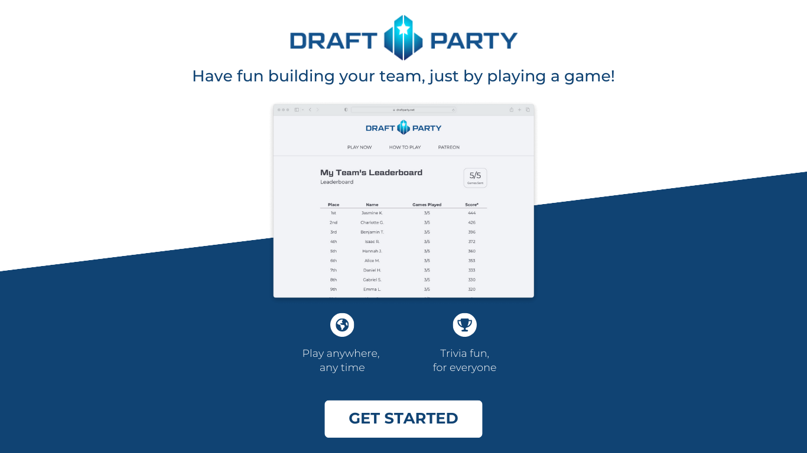

# Draft Party Responsive Demo
### Test Project for prospective developers - Dec 2023

Please convert this mock-up into a single responsive web page. Only HTML and CSS is required. While not required, you may use
any css framework of your choice, if you feel it would be helpful. All assets and information needed to build this page are located
in the repo and this readme. If you have any questions, please ask.

`/mock/FullPageMock.png`

## Requirements 

- Please commit your implementation to your __public__ clone of this repository 
- When you are done, please email me the link to your repository
- Expected effort: 4hrs
- Try to match the mock-up as closely as possible, it does not need to exactly 100%.
- All image assets are located in `/img/`
- Please make the page responsive. Use your best judgement in translating this mock-up to a mobile screen.
- Your page should look the same in the latest versions of Safari, Chrome, and Firefox.
- The DraftParty header image should link to the DraftParty home page: https://draftparty.net
- the "Get Started" Call To Action (CTA) button should link to https://draftparty.net/leaderboards

### Font
Monserrat - https://fonts.google.com/specimen/Montserrat
- Header text is __Bold__
- Bullet points is 

### Colors
-  `#FFFFFF` White
-  `#104373` Draft Blue

### Images

Located in `/img/`
